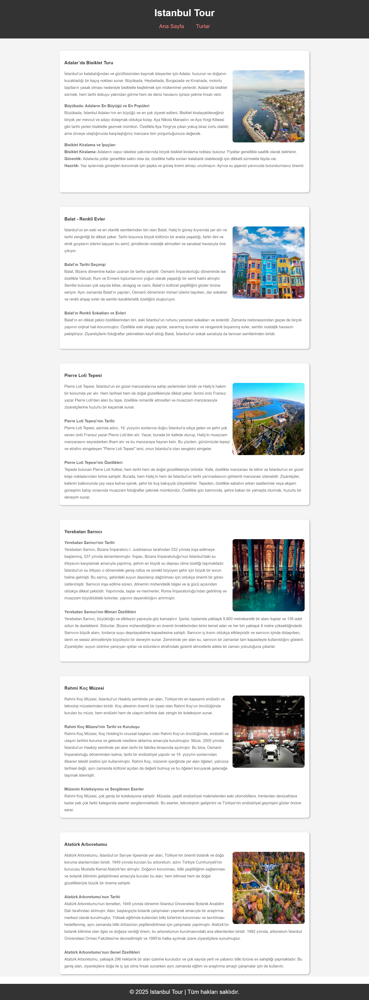

# :world_map: Blog Website Project | Istanbul Tour

[🇹🇷 Click for Turkish README.md](./README.tr.md)

*Created on: February 12, 2025*

* This project is created for Patika Frontend Bootcamp as **Week-2 / Assignment-1 | Blog Website** project.
* A blog website developed using **HTML** and **CSS**.
* Semantic HTML tags and modern web design principles are used.

---

## 🌐 Live Demo

Visit the live website: [Istanbul Tour Blog](https://blog-page-istanbul-tour.vercel.app/)

---

## :computer: Usage

1. Clone the repository
```bash
git clone https://github.com/tunahanyasar/blog-page-istanbul-tour.git
```

2. Navigate to the project directory
```bash
cd blog-page-istanbul-tour
```

3. Open `index.html` in a web browser
   - By double-clicking the file
   - Or using a local server (e.g., VS Code Live Server extension)

---

## 📜 Project Content

### 1. Page Structure
- Created two main pages: *Homepage* and *Tours Page*.
  - Used **Semantic Tags** throughout the pages for better structure.
  - Implemented consistent **header** and **footer** across all pages.

### 2. Homepage Features
- **Header** section with navigation menu
  - Logo and brand name placement
  - Navigation links using **nav** and **a** tags
- **Section** with 6 tour previews
  - Each preview contains:
    - Tour summary information
    - Featured image
    - Link to detailed tour page
- **Footer** with additional information

### 3. Tours Page Features
- Detailed information about each tour
- Organized content using **article** tags
- Direct navigation from homepage to specific tours
- Enhanced visual presentation with images

### 4. Design Elements
- Responsive layout using **Flexbox**
- Consistent styling across pages
- Optimized images for web
- Modern and clean design approach

---

## 💡 Technologies Used

**HTML:**
* Semantic Tags
* Meta Tags
* Navigation Structure
* Article Elements
* Image Integration

**CSS:**
* Flexbox Layout
* Responsive Design
* Custom Properties
* Style Attributes

---

## 📸 Page Outputs

### Homepage


### Tours Page


---

## 🎯 Project Goals

1. **User Experience**
   - Easy navigation between pages
   - Clear tour information presentation
   - Responsive design for all devices

2. **Content Organization**
   - Well-structured tour information
   - Logical content hierarchy
   - Easy access to detailed tour pages

3. **Technical Achievements**
   - Semantic HTML implementation
   - Modern CSS techniques
   - Responsive and accessible design

---

## 📞 Contact

[Tunahan Yaşar](https://github.com/tunahanyasar)

* GitHub: [@tunahanyasar](https://github.com/tunahanyasar)
* LinkedIn: [Tunahan Yaşar](https://www.linkedin.com/in/tunahan-yasar/)