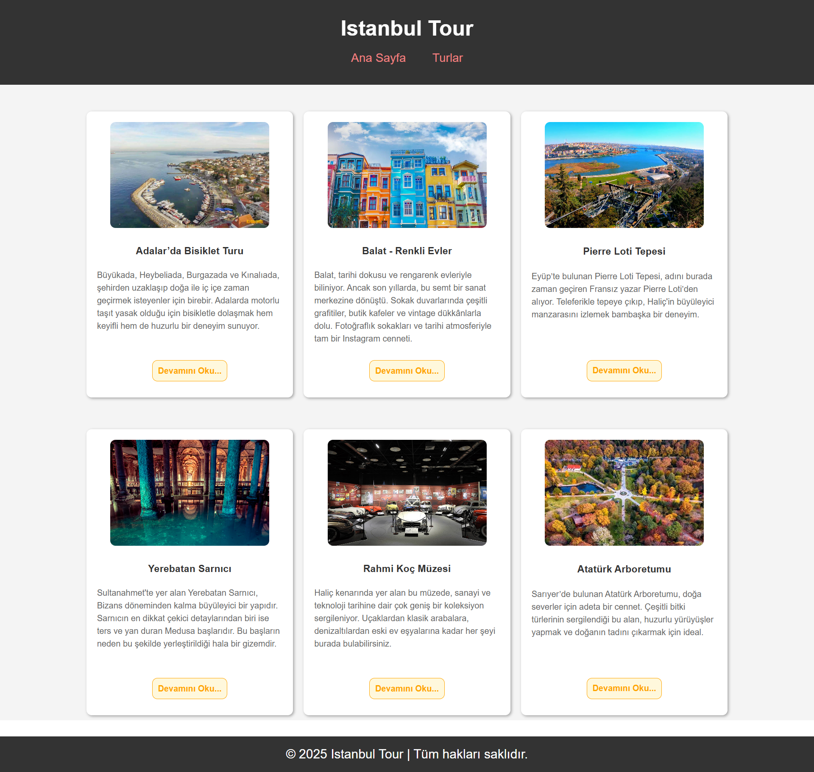
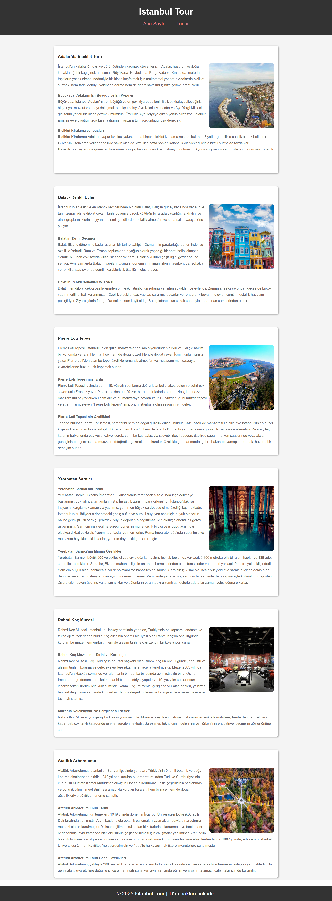

# :world_map: Blog Sitesi Projesi | Istanbul Tour

[🇬🇧 İngilizce README.md için tıklayın](./README.md)

*Oluşturulma Tarihi: 12 Şubat 2025*

* Bu proje, Patika Frontend Bootcamp için **Hafta-2 / Ödev-1 | Blog Sitesi** projesi olarak oluşturulmuştur.
* **HTML** ve **CSS** kullanılarak geliştirilmiş bir blog web sitesidir.
* Semantic HTML etiketleri ve modern web tasarım prensipleri kullanılmıştır.

---

## 🌐 Canlı Demo

Canlı siteyi ziyaret edin: [Istanbul Tour Blog](https://blog-page-istanbul-tour.vercel.app/)

---

## :computer: Kullanım

1. Repoyu klonlayın
```bash
git clone https://github.com/tunahanyasar/blog-page-istanbul-tour.git
```

2. Proje dizinine gidin
```bash
cd blog-page-istanbul-tour
```

3. `index.html` dosyasını bir web tarayıcısında açın
   - Dosyaya çift tıklayarak
   - Veya bir local server kullanarak (örn: VS Code Live Server eklentisi)

---

## 📜 Proje İçeriği

### 1. Sayfa Yapısı
- İki ana sayfa oluşturuldu: *Anasayfa* ve *Turlar Sayfası*.
  - Daha iyi yapı için sayfalarda **Semantic Tags** kullanıldı.
  - Tüm sayfalarda tutarlı **header** ve **footer** uygulandı.

### 2. Anasayfa Özellikleri
- Navigasyon menüsü ile **header** bölümü
  - Logo ve marka adı yerleşimi
  - **nav** ve **a** etiketleri ile navigasyon bağlantıları
- 6 tur önizlemesi ile **section** bölümü
  - Her önizleme şunları içerir:
    - Tur özet bilgileri
    - Öne çıkan görsel
    - Detaylı tur sayfasına bağlantı
- Ek bilgilerle **footer** bölümü

### 3. Turlar Sayfası Özellikleri
- Her tur hakkında detaylı bilgiler
- **article** etiketleri ile düzenlenmiş içerik
- Anasayfadan belirli turlara doğrudan navigasyon
- Görsellerle zenginleştirilmiş sunum

### 4. Tasarım Öğeleri
- **Flexbox** ile responsive düzen
- Sayfalar arası tutarlı stil
- Web için optimize edilmiş görseller
- Modern ve temiz tasarım yaklaşımı

---

## 💡 Kullanılan Teknolojiler

**HTML:**
* Semantic Tags
* Meta Etiketleri
* Navigasyon Yapısı
* Article Elementleri
* Görsel Entegrasyonu

**CSS:**
* Flexbox Düzeni
* Responsive Tasarım
* Özel Özellikler
* Stil Nitelikleri

---

## 📸 Sayfa Çıktıları

### Anasayfa


### Turlar Sayfası


---

## 🎯 Proje Hedefleri

1. **Kullanıcı Deneyimi**
   - Sayfalar arası kolay navigasyon
   - Net tur bilgisi sunumu
   - Tüm cihazlar için responsive tasarım

2. **İçerik Organizasyonu**
   - İyi yapılandırılmış tur bilgileri
   - Mantıksal içerik hiyerarşisi
   - Detaylı tur sayfalarına kolay erişim

3. **Teknik Başarılar**
   - Semantic HTML uygulaması
   - Modern CSS teknikleri
   - Responsive ve erişilebilir tasarım

---

## 📞 İletişim

[Tunahan Yaşar](https://github.com/tunahanyasar)

* GitHub: [@tunahanyasar](https://github.com/tunahanyasar)
* LinkedIn: [Tunahan Yaşar](https://www.linkedin.com/in/tunahan-yasar/) 